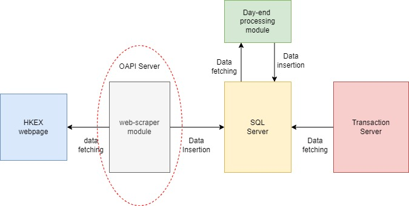
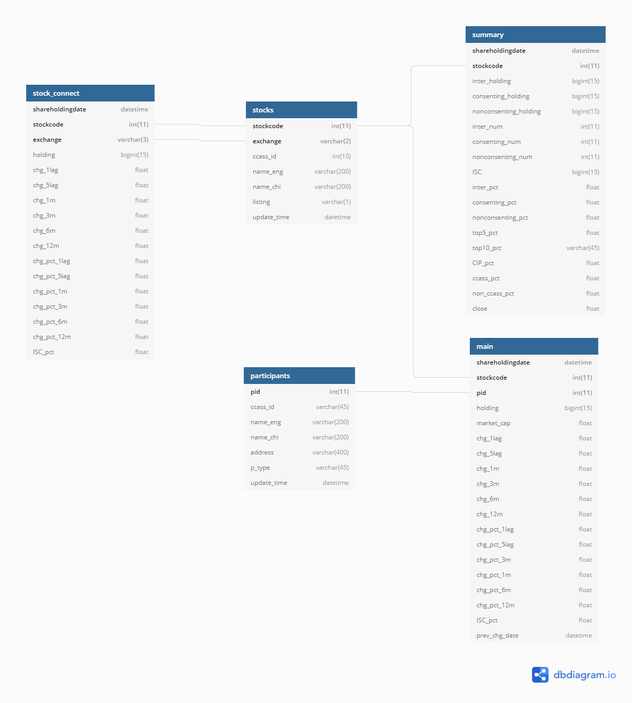

# Introduction
#### This project aims to  provide a web-scraping robot to extract and download the CCASS information from HKEX webpage . 
#### CCASS for HK stocks:  https://www.hkexnews.hk/sdw/search/searchsdw.aspx
#### CCASS for stock-connect scheme:  https://www2.hkexnews.hk/Shareholding-Disclosures/Stock-Connect-Shareholding?sc_lang=en

# CCASS project structure

The CCASS product has four components: (overall workflow is shown as below graph): 
1. web-scrapper module : scrap data from HKEX CCASS pages and insert data to SQL database
2. SQL DB server (schema name: CCASS) : store CCASS data generated from web-scrapper and data from dayend processing scripts
3. Dayend processing module: calculate the processed data after the raw data is scrapped from HKEX webpages and then insert calculated results into SQL DB schema
4. transactional server : produce APIs output and act as between

# CCASS workflow

# SQL database structure
The CCASS raw data is stored at the "CCASS" schema in SQL server. There are five tables in the CCASS schema and each of them is responsible to store one category of CCASS dat. T
- stocks table:  https://www.hkexnews.hk/sdw/search/stocklist.aspx?sortby=stockcode&shareholdingdate={shareholdingdate}
- participants table: https://www.hkexnews.hk/sdw/search/partlist.aspx?sortby=partid&shareholdingdate={shareholdingdate}
- stock_connect : https://www2.hkexnews.hk/Shareholding-Disclosures/Stock-Connect-Shareholding?sc_lang=en
- summary: The upper table in https://www.hkexnews.hk/sdw/search/searchsdw.aspx
- main: The lower table in https://www.hkexnews.hk/sdw/search/searchsdw.aspx

# ER diagram of CCASS schema

